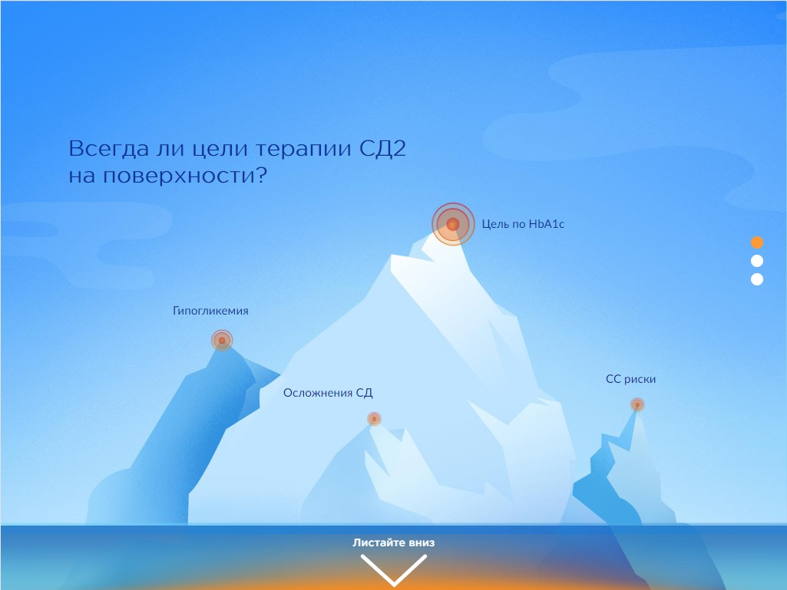
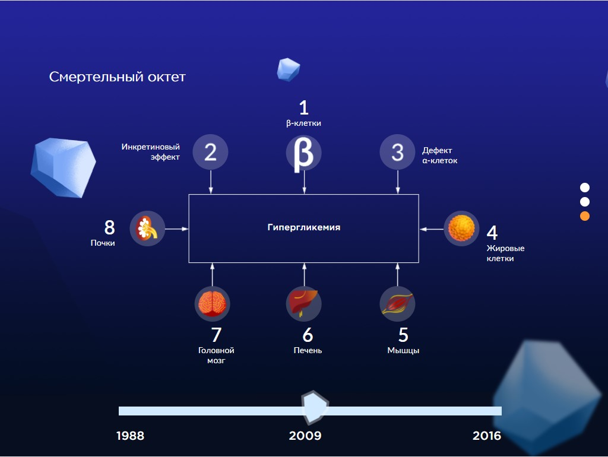
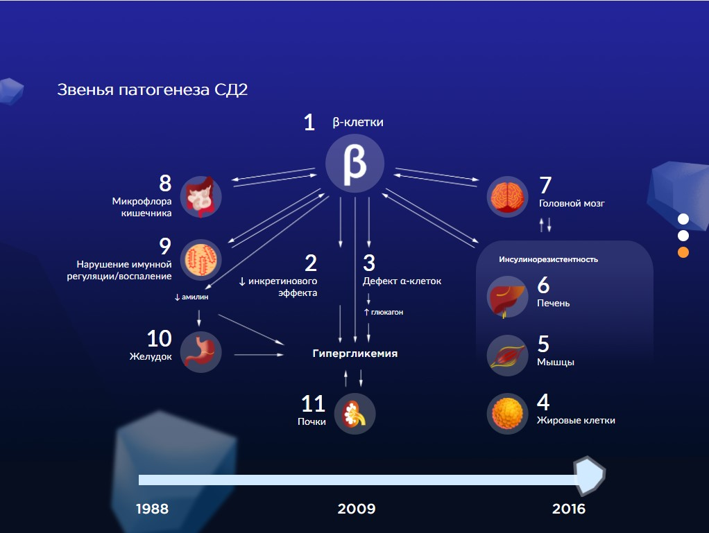

# React-App-Presentation

### Short description

Single page application in a from of presentation for iPad (1024x768 horizontal, Google Chrome). HTML & CSS styling from psd.

Navigation is represented by a scrollbar at page 1, scroll dots at the left side of the screen and mouse wheel scroll.

Technology stack includes:

- JavaScript(ES6)
- React (hooks)
- HTML & CSS
- Webpack

The screenshots are presented below:

